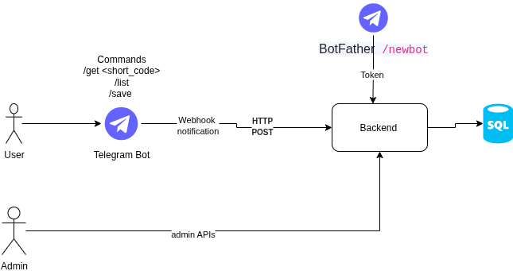
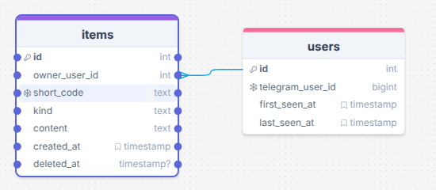

# TinyVault

A service for storing and retrieving short notes and links via Telegram bot with admin API access.

## Features

- **Telegram Bot Integration**: Save URLs and notes with unique short codes
- **Admin REST API**: Monitor users and manage items
- **SQLite Database**: Lightweight, file-based storage with automatic migrations
- **Docker Support**: Easy deployment with docker-compose
- **Clean Architecture**: Layered design with separation of concerns
- **Database Migrations**: Automatic schema management with Alembic
- **Dependency Injection**: Constructor-based dependency management

## System Architecture

The TinyVault system follows a **Clean Architecture** pattern with clear separation of concerns:



**Architecture Layers:**
- **API Layer**: FastAPI endpoints and HTTP handling
- **Service Layer**: Business logic and orchestration
- **Repository Layer**: Data access and persistence
- **Data Layer**: Database session management
- **Model Layer**: SQLAlchemy ORM models

**Key Components:**
- **User Interface**: Telegram Bot for end-user interactions
- **Backend Service**: FastAPI-based REST API handling business logic
- **Database Layer**: SQLite database with SQLAlchemy ORM and Alembic migrations
- **Admin Interface**: REST API for administrative operations
- **Webhook System**: Real-time Telegram update processing

## Database Design

The database uses a normalized schema with proper foreign key relationships:



**Table Relationships:**
- **Users** table stores Telegram user information
- **Items** table contains user-generated content (URLs/notes)
- One-to-many relationship: One user can have multiple items
- Soft delete support with `deleted_at` timestamp

## Project Structure

```
app/
├── __init__.py
├── main.py                 # FastAPI application entry point
├── config.py              # Configuration settings
├── dependencies.py        # Dependency injection container
├── models.py              # SQLAlchemy ORM models
├── schemas.py             # Pydantic validation schemas
├── database.py            # Database configuration
├── api/                   # API Layer
│   ├── __init__.py
│   ├── admin.py          # Admin API endpoints
│   └── telegram.py       # Telegram webhook endpoints
├── services/              # Service Layer
│   ├── __init__.py
│   ├── user_service.py   # User business logic
│   ├── item_service.py   # Item business logic
│   └── telegram_service.py # Telegram bot logic
├── repositories/          # Repository Layer
│   ├── __init__.py
│   ├── base_repository.py # Generic repository interface
│   ├── user_repository.py # User data access
│   └── item_repository.py # Item data access
└── data/                  # Data Layer
    ├── __init__.py
    └── session_manager.py # Database session management
```

## Quick Start

### Prerequisites

- Python 3.11+
- Docker and Docker Compose
- Telegram Bot Token

### 1. Clone and Setup

```bash
git clone <repository-url>
cd TinyVault

# Create virtual environment
python -m venv .venv
source .venv/bin/activate  # On Windows: .venv\Scripts\activate

# Install dependencies
pip install -r requirements.txt
```

### 2. Environment Configuration

```bash
# Copy environment template
cp env.example .env

# Edit .env with your values
TELEGRAM_BOT_TOKEN=your_bot_token
ADMIN_API_KEY=your_secure_api_key
WEBHOOK_SECRET=optional_webhook_secret
```

### 3. Run with Docker

```bash
# Start the application
docker-compose up -d

# Check logs
docker-compose logs -f app

# View running containers
docker-compose ps
```

### 4. Run Locally

```bash
# Create data directory
mkdir -p data logs

# Initialize database (SQLite will be created automatically)
python -m app.main

# Or run with uvicorn
uvicorn app.main:app --reload --host 0.0.0.0 --port 8000
```

## Database Migrations

TinyVault uses **Alembic** for automatic database schema management. Migrations are automatically generated from your SQLAlchemy models and can be applied safely in production.

### Migration Commands

All migration commands should be run from the project root directory:

```bash
# Check current migration status
.venv/bin/alembic current

# View migration history
.venv/bin/alembic history

# Create new migration from model changes
.venv/bin/alembic revision --autogenerate -m "description of changes"

# Apply pending migrations
.venv/bin/alembic upgrade head

# Rollback to specific revision
.venv/bin/alembic downgrade <revision>

# Check for pending migrations
.venv/bin/alembic heads

# Show migration details
.venv/bin/alembic show <revision>
```

### How Migrations Work

1. **Automatic Detection**: Alembic automatically detects changes in your SQLAlchemy models
2. **Migration Generation**: Creates migration files with upgrade/downgrade operations
3. **Safe Application**: Migrations are applied safely with rollback support
4. **Version Control**: Each migration is versioned and tracked in the database

### Migration Workflow

```bash
# 1. Make changes to your models (e.g., add new fields)
# Edit app/models.py

# 2. Generate migration
.venv/bin/alembic revision --autogenerate -m "add new field to user table"

# 3. Review the generated migration file
# Check migrations/versions/xxx_description.py

# 4. Apply the migration
.venv/bin/alembic upgrade head

# 5. Verify the changes
.venv/bin/alembic current
```

### Example: Adding a New Field

```python
# 1. Update your model in app/models.py
class User(Base):
    # ... existing fields ...
    new_field = Column(String(100), nullable=True)  # Add this line
```

```bash
# 2. Generate migration
.venv/bin/alembic revision --autogenerate -m "add new_field to user table"

# 3. Apply migration
.venv/bin/alembic upgrade head

# 4. Verify
.venv/bin/alembic current
```

### Docker Migration Support

When running with Docker, migrations are automatically applied on container startup:

```bash
# Migrations run automatically when starting containers
docker-compose up -d

# Check migration status inside container
docker-compose exec app alembic current

# Manual migration if needed
docker-compose exec app alembic upgrade head
```

### Migration Files Structure

```
migrations/
├── env.py              # Migration environment configuration
├── script.py.mako      # Migration template
└── versions/           # Generated migration files
    ├── 001_baseline_existing_schema.py
    ├── 3cc3c3543fc4_add_test_field_to_user_table.py
    └── 634d648976e2_remove_test_field_from_user_table.py
```

## API Endpoints

### Telegram Webhook
- `POST /telegram/webhook/<bot_token>` - Handle Telegram bot updates
- `GET /telegram/webhook-info` - Get webhook configuration info

### Admin API (requires `X-API-Key` header)
- `GET /admin/users` - List all users with item counts
- `GET /admin/items?user_id=X` - Get items for specific user
- `DELETE /admin/items/{short_code}` - Delete any item
- `GET /admin/stats` - Get system-wide statistics

### Public
- `GET /` - API information
- `GET /health` - Health check endpoint
- `GET /info` - Application configuration info
- `GET /docs` - Interactive API documentation (Swagger UI)

## Telegram Bot Commands

- `/start` - Welcome message and help
- `/help` - Show available commands
- `/save <content>` - Save URL or note
- `/list` - Show your 5 most recent items
- `/get <code>` - Retrieve item by short code
- `/del <code>` - Delete item by short code

## Database Schema

### Users Table
- `id` - Primary key (auto-increment)
- `telegram_user_id` - Unique Telegram user ID (BIGINT)
- `first_seen_at` - First interaction timestamp
- `last_seen_at` - Last interaction timestamp (auto-updated)

### Items Table
- `id` - Primary key (auto-increment)
- `owner_user_id` - Foreign key to users table
- `short_code` - Unique short code for retrieval
- `kind` - Either 'url' or 'note'
- `content` - The actual URL or note content
- `created_at` - Creation timestamp
- `deleted_at` - Soft delete timestamp (nullable)

### Indexes and Constraints
- Unique constraint on `users.telegram_user_id`
- Unique constraint on `items.short_code`
- Foreign key constraint: `items.owner_user_id` → `users.id`
- Automatic trigger to update `last_seen_at` on user updates

## Configuration

| Variable | Description | Required | Default |
|----------|-------------|----------|---------|
| `DB_URL` | Database connection string | Yes | SQLite path |
| `TELEGRAM_BOT_TOKEN` | Bot token from @BotFather | Yes | - |
| `ADMIN_API_KEY` | Secret key for admin API | Yes | - |
| `WEBHOOK_SECRET` | Webhook verification secret | No | - |

## Development

### Architecture Principles

1. **Separation of Concerns**: Each layer has a specific responsibility
2. **Dependency Injection**: Constructor-based dependency management
3. **Interface Segregation**: Clients only depend on methods they use
4. **Single Responsibility**: Each class has one reason to change
5. **Open/Closed**: Open for extension, closed for modification

### Key Features

1. **Idempotency**: Prevents duplicate processing of Telegram updates
2. **Short Code Uniqueness**: Generates unique codes with conflict resolution
3. **URL Validation**: Automatically detects and validates URLs
4. **Soft Deletes**: Items are marked as deleted rather than removed
5. **Async Operations**: Full async/await support throughout
6. **Security**: Non-root Docker containers with proper user permissions
7. **Database Migrations**: Automatic schema management with Alembic
8. **Clean Architecture**: Layered design with dependency injection

### Testing

```bash
# Run tests
pytest

# Run with coverage
pytest --cov=app

# Run specific test file
pytest tests/test_item_service.py
```

### Adding New Models

When adding new models, follow this workflow:

1. **Update Models**: Add new model classes to `app/models.py`
2. **Create Repository**: Extend `BaseRepository` in `app/repositories/`
3. **Implement Service**: Add business logic in `app/services/`
4. **Create API Endpoints**: Handle HTTP requests in `app/api/`
5. **Update Dependencies**: Wire up new components in `app/dependencies.py`
6. **Generate Migration**: `.venv/bin/alembic revision --autogenerate -m "add new model"`
7. **Apply Migration**: `.venv/bin/alembic upgrade head`
8. **Test**: Verify the new functionality works correctly

### Modifying Existing Models

When modifying existing models:

1. **Update Model**: Modify the model class in `app/models.py`
2. **Update Repository**: Add new methods to the repository if needed
3. **Update Service**: Modify business logic in the service layer
4. **Update API**: Modify endpoints if needed
5. **Generate Migration**: `.venv/bin/alembic revision --autogenerate -m "modify user table"`
6. **Review Changes**: Check what the migration will do
7. **Apply Migration**: `.venv/bin/alembic upgrade head`
8. **Test**: Verify the changes work correctly

## Deployment

### Automated Deployment (Recommended)

TinyVault supports automated deployment to EC2 using GitHub Actions and Ansible.

#### Setup GitHub Secrets

Configure the following secrets in your GitHub repository (**Settings** → **Secrets and variables** → **Actions**):

**Required Secrets:**
- `EC2_HOST` - Your EC2 instance public IP
- `SSH_PRIVATE_KEY` - Your AWS private key file content (e.g., `aws_keys.pem`)
- `TELEGRAM_BOT_TOKEN` - Telegram bot token from BotFather
- `ADMIN_API_KEY` - API key for admin access
- `WEBHOOK_SECRET` - Secret for webhook security

**Optional Secrets:**
- `DB_URL` - Database URL (defaults to SQLite)
- `APP_NAME` - Application name (defaults to `TinyVault`)

#### Deploy

1. Push to `main` branch or manually trigger the workflow
2. Monitor deployment in **Actions** tab
3. Access your application at `http://[EC2_HOST]:8000`

For detailed setup instructions, see [GITHUB_SECRETS.md](GITHUB_SECRETS.md).

### Docker

```bash
# Build and run
docker-compose up --build

# Production build
docker build -t tinyvault .
docker run -p 8000:8000 --env-file .env tinyvault

# View container logs
docker-compose logs -f app

# Stop services
docker-compose down
```

### Environment Variables

Ensure all required environment variables are set in production:
- `TELEGRAM_BOT_TOKEN`
- `ADMIN_API_KEY`
- `DB_URL` (for production databases)
- `WEBHOOK_SECRET` (recommended for production)

### Production Migrations

In production, migrations are automatically applied when containers start:

```bash
# Start production environment
docker-compose -f docker-compose.yml -f docker-compose.prod.yml up -d

# Check migration status
docker-compose exec app alembic current

# Manual migration if needed
docker-compose exec app alembic upgrade head
```

## Webhook Setup

1. Set your bot's webhook URL:
   ```
   https://api.telegram.org/bot<BOT_TOKEN>/setWebhook?url=https://yourdomain.com/telegram/webhook
   ```

2. If using `WEBHOOK_SECRET`, include it in the webhook URL:
   ```
   https://yourdomain.com/telegram/webhook?secret=<WEBHOOK_SECRET>
   ```

## Troubleshooting

### Common Issues

1. **Database Connection**: Ensure data directory exists and is writable
2. **Telegram Webhook**: Verify bot token and webhook URL
3. **Admin API**: Check `X-API-Key` header is set correctly
4. **Port Conflicts**: Ensure port 8000 is available
5. **Docker Issues**: Check container logs with `docker-compose logs`
6. **Migration Errors**: Check migration history and current revision

### Logs

```bash
# Docker logs
docker-compose logs app

# Local logs
tail -f logs/app.log

# View all container status
docker-compose ps
```

### Health Checks

The application includes built-in health checks:
- **Docker Health Check**: Monitors container health every 30 seconds
- **API Health Endpoint**: `/health` endpoint for external monitoring
- **Database Connectivity**: Automatic database connection validation

### Migration Troubleshooting

```bash
# Check migration status
.venv/bin/alembic current

# View migration history
.venv/bin/alembic history

# Check for pending migrations
.venv/bin/alembic heads

# Rollback if needed
.venv/bin/alembic downgrade <revision>

# Check database schema
sqlite3 data/tinyvault.db ".schema users"
```

### Common Migration Issues

1. **Circular Imports**: Ensure models are imported correctly in `migrations/env.py`
2. **Schema Mismatch**: Check if database schema matches your models
3. **Index Conflicts**: Remove duplicate indexes manually if needed
4. **Foreign Key Issues**: Ensure foreign key constraints are properly defined

### Recovery from Migration Failures

```bash
# If a migration fails, you can rollback
.venv/bin/alembic downgrade <previous_revision>

# Fix the issue in your models
# Regenerate the migration
.venv/bin/alembic revision --autogenerate -m "fixed migration"

# Apply the corrected migration
.venv/bin/alembic upgrade head
```

## Contributing

1. Fork the repository
2. Create a feature branch
3. Make your changes
4. **Create migrations** for any database changes
5. Add tests
6. Submit a pull request

### Migration Guidelines for Contributors

- Always create migrations for database schema changes
- Use descriptive migration messages
- Test migrations on a copy of production data
- Include both upgrade and downgrade operations
- Document any manual steps required

### Architecture Guidelines

- Follow the layered architecture pattern
- Use dependency injection for all dependencies
- Keep services focused on business logic
- Use repositories for all data access
- Maintain separation of concerns

## Documentation

- **README.md**: This file - project overview and quick start
- **ARCHITECTURE.md**: Detailed architecture documentation
- **API Docs**: Interactive documentation at `/docs` endpoint

## License

This project is licensed under the MIT License. 